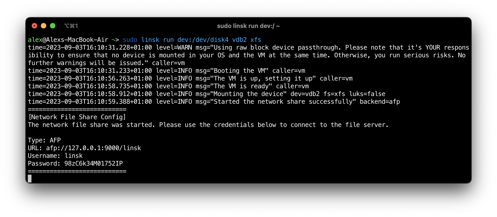

# Linsk

<a href="https://t.me/linsk_foss"></a>

**Linsk** is a utility that allows you to access Linux-native file system infrastructure, including LVM and LUKS on Windows and macOS. Unlike other solutions created to access Linux filesystems on unsupported operating systems, Linsk does not reimplement any file system. Instead, Linsk utilizes a lightweight Alpine Linux VM (~130 MB only) combined with network share technologies like SMB, AFP, and FTP.

Because Linsk uses a native Linux VM, there are no limitations on what you can access. Anything that works on Linux will work under Linsk too (hence the Linux+Disk name).

To show your thanks, please star this repository if you found it useful.



# 💻 Supported platforms

## CPU architectures
Linsk natively supports both **x86_64** (aka amd64, Intel, AMD, etc.) and **aarch64** (aka arm64, Apple M1/M2, and others).

Although Linsk uses a virtual machine, the CPU is never emulated but the hardware accelerators like HVF (macOS), WHPX (Windows), and KVM (Linux) are used.

## Operating systems

* **Windows**
* **macOS**
* **Linux** (for development purposes, mostly)

## Network file share backends

Linsk relies on network file shares to expose files to the host machine. Below are the types of network shares Linsk supports:

* **SMB** - The default for Windows.
* **AFP** - The default for macOS.
* **FTP** - An alternative backend.

# 💿 Installation

- **Windows** - See [INSTALL_WINDOWS.md](INSTALL_WINDOWS.md).
- **macOS** - See [INSTALL_MACOS.md](INSTALL_MACOS.md).
- **Linux** - Refer to [LINUX_DEV_ENV.md](LINUX_DEV_ENV.md).

# 🔧 Usage

- **Windows** - See [USAGE_WINDOWS.md](USAGE_WINDOWS.md).
- **macOS** - See [USAGE_MACOS.md](USAGE_MACOS.md).

# ⚠️ Serious bug disclosures (Obsolete versions)

Linsk versions below **v0.2.0** are considered obsolete **UNLESS**:
* The use of Linsk was limited exclusively to devices with a 512-byte logical block (sector) size; **or**
* The experimental USB passthrough was used.

More information: [serious-bug-disclosures/README.md](serious-bug-disclosures/README.md)

# 👨‍💻 Contributing

Please see [CONTRIBUTING.md](CONTRIBUTING.md).

# ©️ Copyright and License

Copyright (c) 2023 The Linsk Authors.

Provided under the GNU General Public License v3. The copy of the license is included in the LICENSE file.

Use this `git` command to view the list of Linsk Authors:
```sh
git log --format='%aN <%aE>' | sort -uf
```
